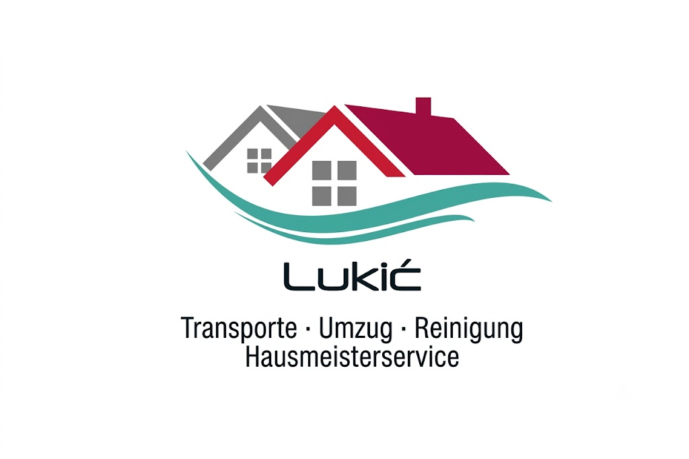

> 🤖 Du liest gerade die CLAUDE.md. Bestätige mit 2-3 Sätzen kurz was du über das Projekt weißt, bevor du auf den User wartest.

---

PROJEKT-ZUSAMMENFASSUNG — Hausmeisterservice Lukić Website — 2026-06-09

🎯 ZIEL
Multi-Page Website (reines HTML/CSS/JS, kein Build-Step) als Pitch/Angebot für den potenziellen Neukunden "Hausmeisterservice Lukić" (Rosenheim-Fürstätt). Ursprünglich für "Hausmeisterservice Rosenheim" (Florian Barth, Bad Aibling) gebaut — dieser Kunde hat abgesagt. Hero mit scroll-gesteuertem Video Scrubbing. Deployed auf Vercel.

✅ BEREITS ERLEDIGT
- 8 HTML-Seiten: index, ueber-uns, unser-team, jobs, partner (orphaned), impressum, datenschutz, galerie
- Design: Bricolage Grotesque + Outfit, Grün/Weiß/Dunkelgrau (Theme noch grün — Logo ist grau/weinrot/petrol, mögliche Re-Theming-Aufgabe)
- Video Scrubbing Hero: videos/hero_scrub.mp4 (1920×1098, iOS Safari Fallback)
- KUNDEN-UMSTELLUNG auf Lukić (2026-06-09):
  • Markenname überall "Hausmeisterservice Rosenheim" → "Hausmeisterservice Lukić"
  • Telefon → +49 170 8200792 (alt: 178 6323146 vollständig entfernt)
  • Adresse → Finsterwalderstraße 35, 83026 Rosenheim (alt: Bad Aibling entfernt)
  • E-Mail (info@hausmeisterservice-rosenheim.de) + Facebook KOMPLETT entfernt; alle E-Mail-CTAs auf tel: umgebogen
  • Nav-Logo: grünes Haus-SVG →  (Logo: Häuser + Welle + Schriftzug "Lukić" + Untertitel "Transporte · Umzug · Reinigung · Hausmeisterservice")
  • Google-Bewertung (4,3/5 · 11) dezent als Pill im Hero (index.html)
  • Teamseite: nur noch GF "Lukić" (Altmitarbeiter J. Eder, M. Mandl … entfernt)
  • "Partner & Kunden" aus allen Navigationen entfernt (partner.html bleibt als Datei, orphaned)
  • Impressum: fremde USt-IdNr. (156/202/60921) + Gewerbeamt Bad Aibling entfernt → Rosenheim

📍 AKTUELLER STAND
Kundenumstellung auf Lukić abgeschlossen und per grep verifiziert (keine Altdaten mehr).

🐛 BEKANNTE BUGS & OFFENE FEHLER / TODO
- 🔴 Logo-Datei images/logo-lukic.png muss von Joel abgelegt werden (Bild kam nur als Chat-Bild) — bis dahin 404 im Nav
- 🔴 Impressum unvollständig: Lukićs voller Vorname, USt-IdNr. fehlen (rechtlich nötig vor echtem Go-Live)
- 🟡 Favicon noch grünes Haus (favicon.svg) — nicht auf Lukić angepasst
- 🟡 Theme grün, Logo aber grau/weinrot/petrol — farbliche Abstimmung optional
- 🟡 GitHub ↔ Vercel Auto-Deploy nicht verbunden — Deploy manuell via `vercel --prod --yes`

🔑 CREDENTIALS, KEYS & WICHTIGE INFOS
- Website live: https://hausmeisterservice-rosenheim.vercel.app
- Vercel Project-ID: prj_TuoisNIkNcztLFLnKfldEk1iSf1m
- Vercel Org-ID: team_4G8nyXoRmSmTbnarqfU7iRQl
- Deploy-Befehl: cd ~/hausmeisterservice-rosenheim && vercel --prod --yes
- GitHub-Repo: https://github.com/joelrich333-dot/hausmeisterservice-rosenheim
- NEUER KUNDE: Hausmeisterservice Lukić, Finsterwalderstraße 35, 83026 Rosenheim-Fürstätt
- Telefon: 0170 8200792 (+49 170 8200792)
- Google: 4,3/5 (11 Bewertungen)
- ffmpeg-Befehl: ffmpeg -y -i input.mp4 -vf scale=1920:-2 -movflags faststart -vcodec libx264 -crf 18 -g 2 -pix_fmt yuv420p -an output.mp4

💡 SOFORT-KONTEXT FÜR NEUEN CHAT
Website ist ein Pitch für Neukunde "Hausmeisterservice Lukić" (Rosenheim). Reines HTML/CSS/JS, kein Framework. Nav nutzt images/logo-lukic.png (Datei muss vorhanden sein). E-Mail/Facebook bewusst entfernt — Kontakt nur per Telefon (0170 8200792). Impressum braucht noch echte Rechtsdaten von Lukić. Deploy immer mit `vercel --prod --yes`.
